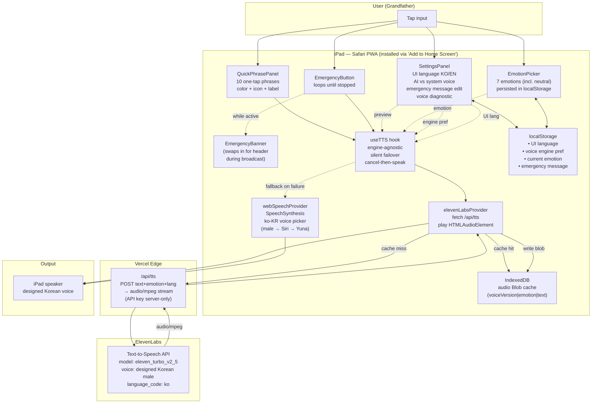

# Talk Again

> A communication-aid PWA for my grandfather, who has been unable to speak since a tongue resection.
> SCAD AI 201, Project 3 — "Persons Required".

**Live URL:** https://talk-again.vercel.app/
**Repo:** https://github.com/chanhwi-keyoh/talk-again

---

## Submission documents

Required by the Project 3 grading checklist — every link is part of this repo.

| Document | File |
|---|---|
| Design Argument | [`docs/Design_Argument.md`](./docs/Design_Argument.md) |
| Research Documentation | [`docs/Research_Documentation.md`](./docs/Research_Documentation.md) |
| Platform Rationale | [`docs/Platform_Rationale.md`](./docs/Platform_Rationale.md) |
| AI Direction Log | [`docs/AI_Direction_Log.md`](./docs/AI_Direction_Log.md) |
| Records of Resistance | [`docs/Records_of_Resistance.md`](./docs/Records_of_Resistance.md) |
| Five Questions | [`docs/Five_Questions.md`](./docs/Five_Questions.md) |
| Post-Mortem | [`docs/Post_Mortem.md`](./docs/Post_Mortem.md) |
| User Testing Evidence | [`docs/User_Testing_Evidence.md`](./docs/User_Testing_Evidence.md) + [`docs/evidence/`](./docs/evidence/) |
| Mermaid system diagram | [`architecture.mmd`](./architecture.mmd) + inline below |

---

## System architecture (Mermaid)



(Source: [`architecture.mmd`](./architecture.mmd))

---

## What ships in this build

**Step 1 — Shell + elderly-tuned UX**
- Vite + React 18 + TypeScript + Tailwind CSS
- `vite-plugin-pwa` — installable from iPad Safari "Add to Home Screen"
- Pretendard Korean font; typography scale baked from elderly-UX research (body ≥ 24 px, button labels 36–44 px, line-height ≥ 1.5, no thin weights)
- `QuickPhrasePanel` — 5×2 grid of 10 one-tap Korean utterances. Every tile carries three redundant signals (color + icon + label) per WCAG / lens-yellowing research.
- Korean / English UI toggle in Settings
- Voice-readiness chip in the header that explains itself if no Korean voice is installed

**Step 1.5 — A warm synthesised voice (Voice Design, not cloning)**
- A custom Korean elder-male voice generated through **ElevenLabs Voice Design** from a text description. The grandfather's pre-surgery voice does not exist on tape and a post-surgery sample is not his identity (see Design Argument §6) — so we generate, never clone.
- `api/tts.ts` — Vercel Edge serverless function. The ElevenLabs key lives server-side only; secrets deliberately *don't* use Vite's `VITE_` prefix so they can never leak into the browser bundle.
- IndexedDB blob cache — every repeat tap of the same phrase costs zero network and zero credits.
- `useTTS` silent failover — if the cloud TTS fails, the same call falls through to the device's Web Speech voice and the header chip explains the downgrade. The grandfather always hears *something*.
- Settings "Voice" section — two big toggles (AI voice / standard voice).
- `npm run dev` alone serves `/api/tts` (no Vercel CLI needed — a Vite middleware mounts the same Edge handler locally).

**Step 2 — Emotion picker**
- `EmotionPicker` — seven horizontal tiles (`보통` + 6 emotions). Tap one to shift TTS prosody (rate / pitch on the system voice, `stability` / `style` on the ElevenLabs voice). Persists across reloads.
- Departure from the original "radial picker" spec: a linear grid has uniform tap geometry, which is friendlier to shaky hands.

**Step 5 (partial) — Emergency button + visible address banner**
- `EmergencyButton` in the header. Tap once to start a loud broadcast of the user-configured emergency message; tap again to stop. Loops until stopped — an emergency shouldn't auto-quiet.
- When broadcasting, the entire header swaps to a high-contrast red `EmergencyBanner` that shows the **full message text including the address**. A helper or 119 staffer who walks in mid-broadcast can read the address even after the audio peak.
- Editable emergency message in Settings, with a "Listen once" preview and a "Restore default" button.
- The configured message is identical every iteration, so the IndexedDB cache makes an hour-long broadcast cost exactly one ElevenLabs call.

## Development

```bash
npm install

# Create .env.local from the template and fill in your ElevenLabs credentials
cp .env.example .env.local
# Then set:
#   ELEVENLABS_API_KEY=sk_...
#   ELEVENLABS_VOICE_ID=...
#   ELEVENLABS_MODEL_ID=eleven_turbo_v2_5

npm run dev          # http://localhost:5173 (also exposes the LAN IP via --host)
npm run build        # typecheck + production build
npm run preview      # serve the built bundle locally
```

> The app still works without `.env.local`. When `/api/tts` returns 503 ("tts_not_configured"), the client silently falls back to the device's Web Speech voice.

To install on an iPad on the same Wi-Fi: open `http://<your-mac-lan-ip>:5173` in iPad Safari, then **Share → Add to Home Screen**. It launches full-screen like a native app.

> Note: iPad Safari's `SpeechSynthesis` will not produce audio until the page has received its first user gesture. Tap any button once after loading; everything works from there.

## Folder layout

```
talk-again/
├── index.html
├── vercel.json                       Vercel build / runtime config
├── public/                           PWA icons (placeholder for now)
├── api/
│   └── tts.ts                        Edge serverless — ElevenLabs proxy
├── src/
│   ├── main.tsx
│   ├── App.tsx
│   ├── types.ts
│   ├── components/
│   │   ├── I18nProvider.tsx
│   │   ├── VoicePrefProvider.tsx
│   │   ├── EmotionProvider.tsx
│   │   ├── EmergencyProvider.tsx
│   │   ├── QuickPhrasePanel.tsx
│   │   ├── EmotionPicker.tsx
│   │   ├── EmergencyButton.tsx
│   │   ├── EmergencyBanner.tsx       Replaces header during broadcast
│   │   ├── EmergencySettings.tsx
│   │   ├── SettingsPanel.tsx
│   │   ├── VoiceDiagnostic.tsx       Lists installed Korean voices
│   │   └── VoiceStatusChip.tsx
│   ├── hooks/
│   │   └── useTTS.ts                 Engine-agnostic + silent failover
│   ├── lib/
│   │   ├── i18n.ts
│   │   ├── voicePref.ts
│   │   ├── emotion.ts
│   │   ├── emergency.ts
│   │   ├── phrases.ts
│   │   ├── storage.ts
│   │   ├── voices.ts                 System Korean voice picker
│   │   └── tts/
│   │       ├── types.ts              TTSProvider interface
│   │       ├── cache.ts              IndexedDB blob cache
│   │       ├── webSpeech.ts          Fallback provider
│   │       ├── elevenLabs.ts         AI provider
│   │       └── index.ts
│   └── styles/
│       └── globals.css
├── docs/
│   ├── Design_Argument.md            Written by the student (academic rules)
│   ├── Platform_Rationale.md         Why iPad + PWA
│   ├── AI_Direction_Log.md           Decision log with Claude Code (6 entries)
│   └── …                             Records of Resistance, User Testing, Five Questions, Post-Mortem
├── CLAUDE.md                         Working rules for Claude Code
├── PROJECT_BRIEF.md                  Background notes from the Cowork session
└── architecture.mmd                  Mermaid system diagram
```

## Deferred to v2 (intentionally not built for this submission)

- **Persona onboarding** (Step 3) — a 10-question Q&A whose answers go into the AI suggestions' system prompt.
- **AI suggestions** (Step 4) — short-loop STT → Claude API → three candidate replies that match the grandfather's personality.
- **Free-text input** (Step 5 remainder) — a big textarea + speak button as a last-resort fallback.
- **Handwriting pad** (stretch) — Apple Pencil canvas + Korean OCR/ink → speak.
- **Memory / reminders** (stretch) — extract appointments from conversation, surface them at the right time.
- **Full offline + local LLM**, **voice restoration**, **native iOS app** — Production v2.

See `docs/Post_Mortem.md` for the reasoning behind each deferral.
