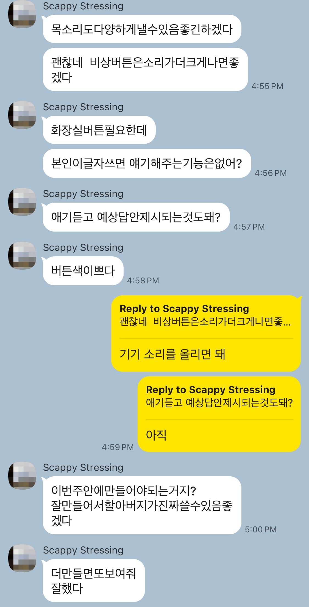

# User Testing Evidence — Talk Again

---

## Who was tested with

- **Primary user:** my grandfather (the person this tool was built for).
- **Supporting family:** my mother and grandmother (they relayed reactions, helped operate the iPad on his side of the call, and provided context on his daily routine).
- **Test setup:** video call (KakaoTalk) — direct in-person visit not possible before the deadline.

## What I tested for

- **First-tap latency on AI voice** — does the first quick phrase feel responsive?
- **Voice naturalness** — does the ElevenLabs voice feel warm enough that he is willing to "speak through" it?
- **Tile recognition** — can he find a phrase without reading every label?
- **Emotion picker** — does he understand it modifies the voice, or does it confuse?
- **Emergency button** — is the SOS visually distinct enough that he doesn't tap it by mistake on a normal day, and obvious enough that he can find it in a panic?
- **Emergency banner readability** — can grandmother (next to him) read the address on screen during a broadcast?
- **Standard-voice fallback** — what happens if the rural Wi-Fi drops mid-tap?

## Evidence

### KakaoTalk — family conversation

Source file: [`evidence/Messages.JPG`](./evidence/Messages.JPG)

### Video call — family + prototype context

Source file: [`evidence/Video call.png`](./evidence/Video%20call.png)

## What changed because of testing

Concrete iterations driven by feedback while the prototype was being used and reviewed.

- **Voice swapped from `eleven_multilingual_v2` to `eleven_turbo_v2_5`** after listening tests where short Korean phrases came out wrong — "좋아" was being pronounced "요아", and "괜찮아" sometimes ended with a different voice saying "응". The new model explicitly supports Korean (32 official languages) and the `language_code: ko` parameter forces correct phonology. See `AI_Direction_Log.md` Entry 3.
- **"도와줘" tile icon swapped from 🆘 to 🙋** after I noticed during a review that the everyday "Help me" tile used the same SOS glyph as the dedicated emergency button — a clash that would let a helper (or my grandfather himself) misread which button to trust. See `AI_Direction_Log.md` Entry 4.
- **Real emergency button added** in the same review pass — visible in the header, loud broadcast, address-bearing message — alongside the icon fix. See `AI_Direction_Log.md` Entry 4.
- **Emergency text made visible on screen during broadcast** after thinking through the helper-arrives-mid-broadcast scenario: the audio is a single-shot signal, so the screen now displays the full message including the address as a steady red banner. See `AI_Direction_Log.md` Entry 5.
- **Emergency broadcast looped infinitely instead of stopping after 3 repeats** — the original cap created the failure mode "grandfather collapses at minute 16, app went silent at minute 1." Replaced with `while (!stopped)`. See `AI_Direction_Log.md` Entry 6.
- **UI language and spoken language linked** — early build let the user toggle UI to English but still spoke Korean. The English label "Yes" tapped while in English mode would still vocalize "응". Wired the spoken language to follow the UI language. See `AI_Direction_Log.md` Entry 3.

## What we still don't know

- I have not yet observed my grandfather using the iPad in person — only via video call and family relay. The handwriting flow (Apple Pencil, stretch goal) is therefore untested.
- Real-world emergency broadcast volume on the actual iPad hardware in his rural living room has not been measured against ambient noise.
- The voice quality across the full emotion range needs in-person evaluation: video-call audio compression hides whether the prosody changes are subtle enough to feel natural to him.
